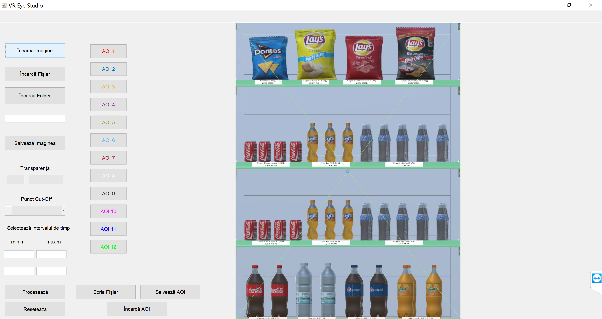
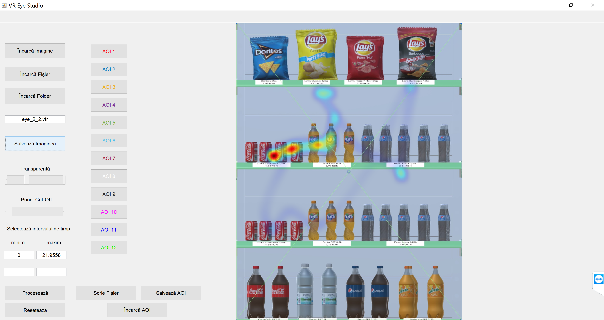
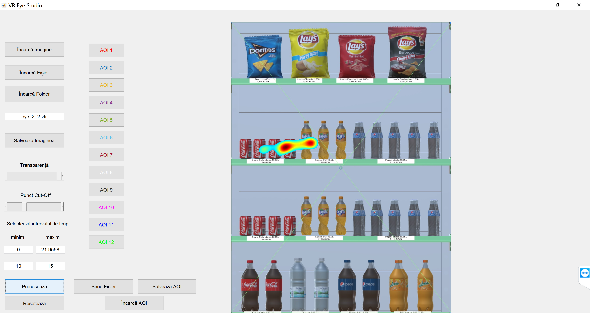
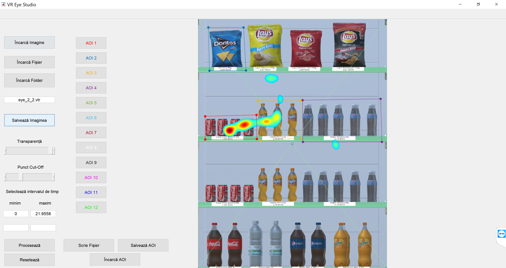

# Shelf Test & VR Eye Studio Applications

Shelf Test is a market research oriented VR application that helps brands test different shelf planograms. Five shelves with different product placement strategies are created and a respondent chooses the desired products from each shelf according to a predefined scenario (ex: buying snacks and beverages for her/his guests). General purchase data, like products bought and returned to shelf is recorded and specific data is generated with the help of VR Eye Studio software, like heatmaps for eye gaze and AOIs (Areas Of Interest) metrics for areas of the shelf defined by the user.

## Hardware requirements

* PC
* [Oculus Rift headset](https://www.oculus.com/rift)
* [Leap Motion controller](https://www.leapmotion.com/) mounted on the VR headset. Please see this link for more details: https://developer.leapmotion.com/documentation/v4/vrar.html


## Software requirements

* Windows 10
* [Oculus application](https://www.oculus.com/setup/)
* [Leap Motion controller VR Setup software](https://developer.leapmotion.com/vr-setup)
* [Unity](https://unity.com/) (tested on version 2017.1.2) (only if you wish to tinker with the Shelf Test App and rebuild it)
* [Matlab](https://www.mathworks.com/products/matlab.html) (only if you wish to check out how the VR Eye Studio works and rebuild it)

## Installing

You can simply download the whole repository or run the following commands to clone just this project:

```
git clone --depth 1 --quiet --no-checkout "https://github.com/AndreiUngureanu101/vr-apps" Apps
cd Apps
git checkout master -- ShelfTestVREyeStudio/
```
Furthermore you'll need to install the VR Eye Studio Application by going into the ```\VR Studio\Compile\for_redistribution``` and running ```\VREyeStudio_web.exe```. This will also install some ```Matlab``` dependencies that need to be downloaded from the web so please be patient.

## Running the Shelf Test application

Go to the ```\ShelfTest\_Builds``` folder and run ```Final Build.exe```. Before going into the actual VR application you will need to click on ```Start``` and input an ```ID``` for this trial. Once the VR part of the application starts you will see a shelf with various products. Using the ***index*** fingers you can ***touch*** any product you wish. This represents the fact that you have selected a product for purchase: a small shopping cart icon will pop out of the product and the product will be transported in the shopping cart area on the left. You can continue selecting a total of ***12*** products from the shelf. If you change your mind regarding any product you can go to the shopping cart and ***touch*** the product that you do not wish to purchase anymore and it will be transported back to the shelf. <br>
Once you are sure about your purchase decisions you need to  push the button near the shopping cart. The shelf will slide away and will be replaced by the next one. As mentioned before, a total of 5 shelves are implemented in this application. If you wish to check out the development details please go to the ```\ShelfTest\Assets``` folder.

## Demo
You can check a short gif demo of the application below:


## Data Collection

After a trial is completed you'll find all the recorded data in the ```\ShelfTest\_Builds\Final Build_Data\Data``` folder. Everything is stored in text files as ```json``` objects. The folder contains the following files:
* A ```DataAll.json``` file that records all the purchased products for all trials. Each object corresponds to one ```ID``` and one ```Raft```(Shelf) and has integer values for all the 12 types of products available on the shelves, each value corresponding to the number of purchased products for that type of product.  

* A ```DataOut.json``` file that follows the format detailed above but records ***only*** the products that have been selected in the shopping cart but returned to the shelf.

* Various files named ```eye_A_B.vtr``` where A is the ```ID``` number and ```B``` is the shelf number. These are the files used by the VR Eye Studio application. Each file records the coordinates of the intersection between the user's gaze (approximated as perpendicular to the center of the headset camera) and the shelf for each frame along with a time stamp. ***!!! Important !!!!*** There is a small bug in the way these files are written to the drive. You'll need to manually modify them, file by file: insert a ```[``` character at the beginning and replace the ```,``` character at the end with ```]```. This step ensures that these files can be read by the VR Eye Studio App.


## Running the VR Eye Studio application
Start the ```VR Eye Studio``` application. The first step is to choose one of the 5 shelves for analysis. Click on ```Incarca Imagine```(Load Image), go to the ```\VR Studio\Shelf Pictures``` and select one of the 5 shelves (Shelf 2 loaded in the figure below):


<p align="center">Figure 1: Shelf 2 image loaded</p

Once you have loaded an image you can load one file to analyze by clicking ```Incarca Fisier```(Load File) or all the files in a folder by clicking ```Incarca Folder```(Load Folder). If you choose the latter make sure you have only recordings corresponding to the particular shelf you wish to analyze. This option aggregates the data from all the files present in the folder. <br>
Go to the ```VR Studio\Demo Data``` folder and choose a file or folder to load. The application will update itself with some information:
* The open ended field under the two load buttons will display the name of the loaded file or folder.

* Two of the four numerical fields in the bottom left of the window will display the start time of this particular shelf test (0 by default) and the end time.
S
* The heatmap corresponding to the loaded data will appear superimposed on the shelf picture.

You can save the heatmap image as is by clicking ```Salveaza Imaginea```(Save Image) or tweak its appearance before saving by altering ```Transparenta```(the transparent parameter) or ```Punct Cut-Off``` (the cut-off point parameter). In the figure below is the loaded ```eye_2_2.vtr``` file.


<p align="center">Figure 2: eye_2_2.vtr file heatmap</p>

One more important feature is the ability to select a certain time window for which a heatmap should be generated. This is done by entering the start time and the end time in the two empty open ended fields, respectively and clicking the ```Proceaseza``` (Process) button. You can click ```Reseteaza``` (Reset) in order to regenerate  the heatmap for the whole duration. In the figure below is the heatmap generated for the time window between seconds ```10``` and ```15```:


<p align="center">Figure 3: eye_2_2.vtr file heatmap for seconds 10 to 15</p>

The last feature of this application is the possibility to define AOIs (Areas Of Interest) for the shelf. This defines the areas of the shelf for which special metrics will be computed. A maximum of ```12``` AOIs can be defined. They are color coded in order to be recognized easily on the image. The image with the defined AOIs can also be saved like a regular heatmap image. In the figure below you can see ```4``` AOIs defined for specific products from the shelf:


<p align="center">Figure 4: 4 AOIs defined for Shelf 4</p>

Once you have defined the AOIs of interest you can press ```Scrie Fisier``` (Write File). This will create a ```DataAOI.json``` file in the ```\VR Studio\Shelf Pictures``` folder. This again creates ```json``` objects which contain the ```ID``` and the ```Raft```(Shelf) information plus 3 metrics computed for each AOI:

* 1: The number of seconds that the gaze was upon each AOIs.

* 2: The duration before the gaze was kept for a whole second on the AOIs.

* 3: The number of times the AOI was gazed upon for at least one second.

This data is stored as a key in the ```json``` file with the following format: ```AOIX_Y```, where ```X``` represents the AOI (from 1 to 12) and Y represents the metric (from 1 to 3 according to the description above).
You can also save the AOIs by clicking ```Salveaza AOI``` and load them by clicking ```Incarca AOI```. <br><br>
The ```VR Eye Studio``` project files can be found in the ```\VR Studio\Matlab Project``` folder.
