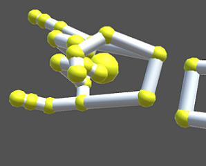

# Static Gestures Recognition Unity project

This Unity project lets you define and use your own static gestures in a VR application. A static gesture is defined as having a frame time duration, so the system will be able to detect an executed gesture for every frame.

## Hardware requirements

* PC
* [Oculus Rift headset](https://www.oculus.com/rift) (even though I haven't tested it on an [Oculus Rift S](https://www.oculus.com/rift-s/) it should work as well)
* [Leap Motion controller](https://www.leapmotion.com/) mounted on the VR headset. Please see this link for more details: https://developer.leapmotion.com/documentation/v4/vrar.html


## Software requirements

* Windows 10
* [Oculus application](https://www.oculus.com/setup/) for your specific headset
* [Unity](https://unity.com/) (tested on version 2019.2.17)
* [Leap Motion controller VR Setup software](https://developer.leapmotion.com/vr-setup)
* [python3](https://www.python.org/download/releases/3.0/) (needed for a specific step in formatting the data used for numerically defining the gestures)

## Installing

Use  ```git clone``` to download the project:

```
git clone ....
```

## Running the application

Open the ```SampleScene``` in the ```Assets\Scenes``` folder and run it using the ```Play``` button. The system is able to detect two predefined gestures, irrespective of the hand used:<br><br>
&nbsp;&nbsp;&nbsp;&nbsp;&nbsp;&nbsp;&nbsp;&nbsp;&nbsp;&nbsp;&nbsp;&nbsp;&nbsp;&nbsp;&nbsp;&nbsp;&nbsp;&nbsp;&nbsp;&nbsp;&nbsp;&nbsp;&nbsp;&nbsp;&nbsp;&nbsp;   &nbsp; &nbsp;  
<br>
&nbsp;&nbsp;&nbsp;&nbsp;&nbsp;&nbsp;&nbsp;&nbsp;&nbsp;&nbsp;&nbsp;&nbsp;&nbsp;&nbsp;&nbsp;&nbsp;&nbsp;&nbsp;&nbsp;&nbsp;&nbsp;&nbsp;&nbsp;&nbsp;&nbsp;&nbsp;&nbsp;&nbsp;&nbsp;&nbsp;&nbsp;&nbsp;&nbsp;&nbsp;&nbsp;&nbsp;&nbsp;&nbsp;&nbsp;&nbsp;&nbsp;&nbsp;&nbsp;&nbsp;&nbsp;&nbsp;&nbsp;&nbsp;&nbsp;
Gesture 1: Like
&nbsp;&nbsp;&nbsp;&nbsp;&nbsp;&nbsp;&nbsp;&nbsp;&nbsp;&nbsp;&nbsp;&nbsp;&nbsp;&nbsp;&nbsp;&nbsp;&nbsp;&nbsp;&nbsp;&nbsp;&nbsp;&nbsp;&nbsp;&nbsp;&nbsp;&nbsp;&nbsp;&nbsp;&nbsp;&nbsp;&nbsp;&nbsp;&nbsp;&nbsp;&nbsp;&nbsp;&nbsp;&nbsp;&nbsp;&nbsp;&nbsp;&nbsp;&nbsp;&nbsp;&nbsp;&nbsp;&nbsp;&nbsp;
Gesture 2: Rock'n'Roll
<br><br>
The ```Console``` will display a ```Debug``` message with the following format:
```
Left hand gesture: A -- Right hand gesture: B
```
where A and B are the detected gestures for each of the two hands. Their values are either ```1``` or ```2```, corresponding to the gestures pictured above or ```-1``` if none of the two gestures is detected. You can use the detection results for further processing by going into the ```Leap Rig``` prefab, selecting ```Hand Models```, opening the ```Classifier``` script and retrieving the ```resultLeft``` and ```resultRight``` variables (which are the variables that store the detected gestures) in the ```Update``` function.

## Defining your own gestures

In order to define you own detectable gestures please follow these instructions:

* Go to the ```Leap Rig``` prefab, select ``` Hand Models```, open the ```Classifier``` script and comment the ```Debug.Log(...)``` line in the ```Update``` function. Technically this step is not necessary but it will help you make sure the data representing your gesture is written correctly to your ```Assets``` folder.

* Enable the ```Write Data``` script and set an ```Id``` for your gesture. This is the value that will be returned once your gesture will be detected. Since the system can detect two gestures the default value has been set to ```3```.

* Start the application by pressing ```Play``` and execute the gesture you want your system to detect with your ***LEFT*** hand. Now click the ```Write Input Vectors``` boolean variable in the ```Write Data``` script. This will write a number equal to the ```No Of Input Vectors``` variable of ```json``` objects (one object per line) in the ```TrainDataJson.json``` file. The system uses a ```SVM (Support Vector Machine)``` model that is trained using this data for prediction and ***each*** ```json``` object represents ***one example*** of that gesture.

* After the data has been written the ```Write Input Vectors``` variable will untick itself. Now you can restart the process and write more ```json``` objects to the drive.  It is recommended to use between ```50``` and ```100``` examples for each gesture. Note that the value of the ```No Of Input Vectors``` has been set to ```10``` by default and that for each of the two gestures that the system can detect ```100``` examples are defined.

* Once you have enough ```json``` objects (examples) for your gesture, open a ```cmd``` window, navigate to the ```Assets``` folder and run the following command: ```python3 JsonToSVM.py```. This step will take the ```json``` data from the ```TrainDataJson.json``` file, reformat it according to the ```SVM (Support Vector Machine)``` library specifications and append it to the ```TrainData.txt``` file.

* Disable the ```Write Data``` script and uncomment the  ```Debug.Log(...)``` line in the ```Update``` function of the ```Classifier``` script and you're done! Now press the ```Play``` button and the application will be able to detect the gestures that you defined!

## Acknowledgments

Special thanks to the wonderful people at [CINETic UNATC ](https://cinetic.arts.ro/en/home/) for making this research project possible!
